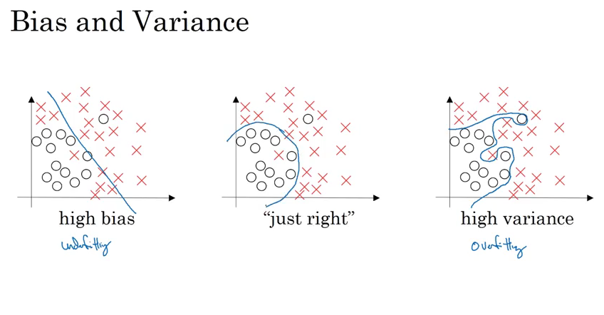
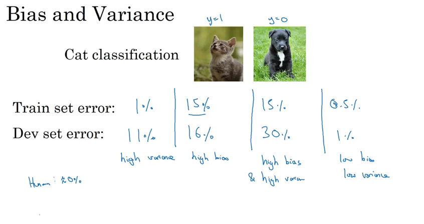
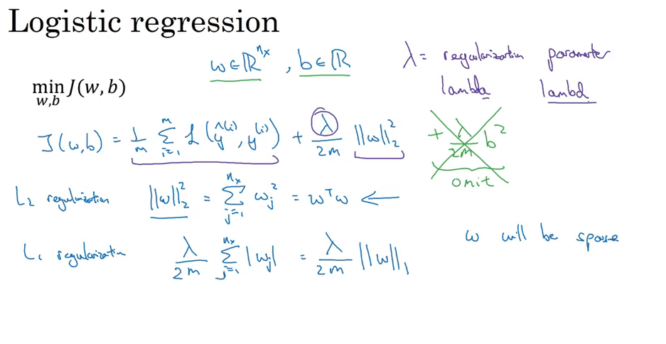
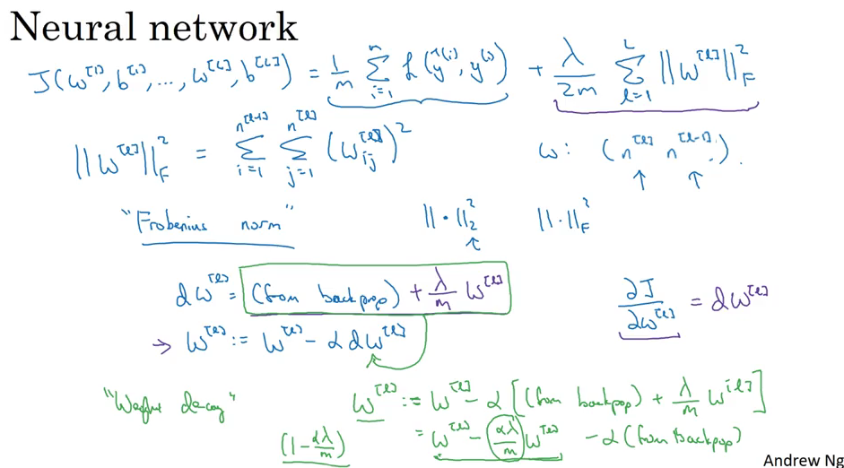
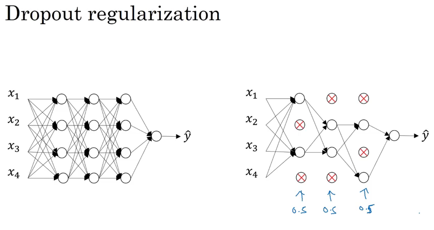
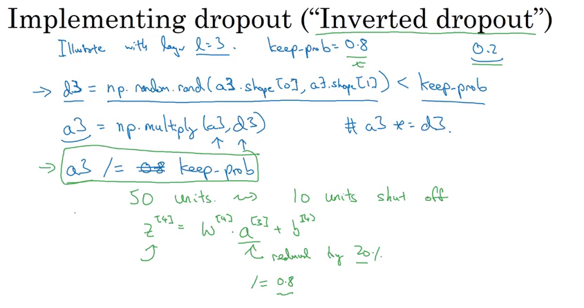
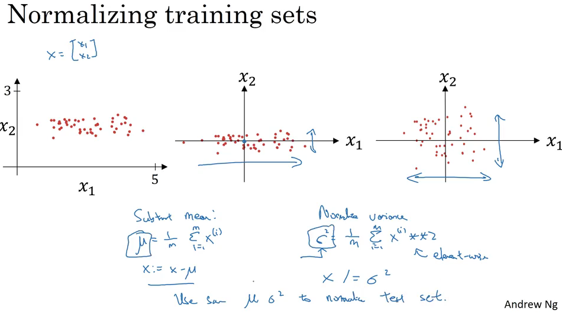
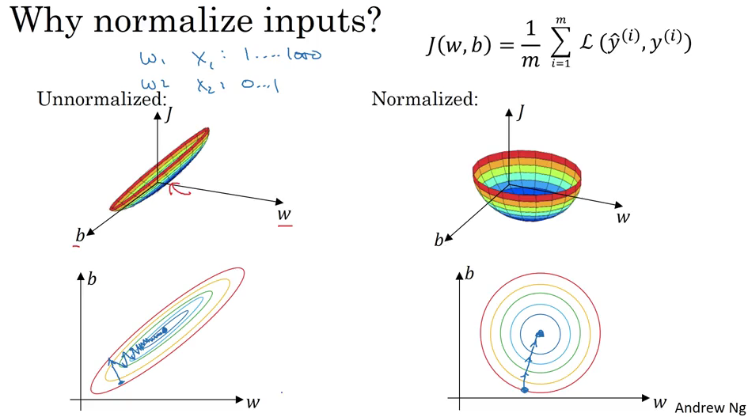
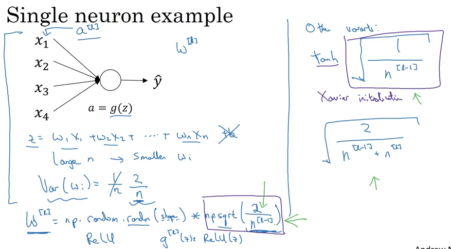
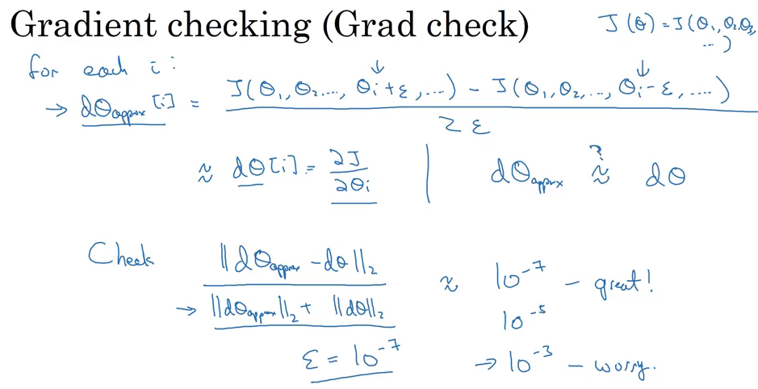

深度学习系列课程第二门课的标题是Improving Deep Neural Networks: Hyperparameter tuning, Regularization and Optimization，第一周的标题是Practical aspects of Deep Learning，学习目标是：

- Recall that different types of initializations lead to different results
- Recognize the importance of initialization in complex neural networks.
- Recognize the difference between train/dev/test sets
- Diagnose the bias and variance issues in your model
- Learn when and how to use regularization methods such as dropout or L2 regularization.
- Understand experimental issues in deep learning such as Vanishing or Exploding gradients and learn how to deal with them
- Use gradient checking to verify the correctness of your backpropagation implementation

对于一个机器学习问题，首先，我们要合理地设置train/dev/test sets，即训练/开发/测试集。机器学习是一个不断迭代的过程，合理地设置训练/开发/测试集可以使得迭代过程更有效率。在过去的那个时代，训练集：测试集=7:3（如果没有开发集的话），或训练集：开发集：测试集=6:2:2，是一个通常的选择，然而在现在这个深度学习时代，数据量很多，比如说有1,000,000个数据，开发集和测试集分别有10,000个数据就够了，这时比例上就是98:1:1。另一个深度学习时代的趋势是，越来越多的人在不同分布的训练集和测试集上训练，一个重要的原则是确保开发集和测试集来自相同的分布。最后，如果你不需要对算法性能进行完全无偏差的估计，那么没有测试集也是可以的，也就是只有训练/开发集，很多人把这个叫做训练/测试集，不过作者认为前者更准确。所以，合理地设置训练/开发/测试集可以加速迭代的过程，还可以使人们更高效地衡量算法的bias和variance，从而决定下一步做什么来提升自己的算法。

据说所有的机器学习大佬都对bias和variance有着深刻的理解，这两个概念学起来很容易，但是不容易真正掌握。在深度学习时代，对bias-variance trade-off的讨论变少了。先看bias和variance的图示，左边是高bias，右边是高variance，中间正好。

从数值上判断，如果训练集错误率比人能达到的错误率高很多，那么存在high bias问题，如果开发集错误率比训练集错误率高很多，那么存在high variance问题。

我们已经知道了如何判断bias和variance问题，下一步我们需要采取行动来解决这些问题。首先，看看有没有high bias问题，如果有，可以尝试使用更大的网络，训练更长的时间，或者使用其他的网络结构。没有了high bias问题，那么再看看有没有high variance问题，如果有，可以尝试收集更多的数据，正则化，或者使用其他的网络结构。

正则化是解决variance问题的一个重要方法，先回顾一下logistic回归中的正则化，一般用L2正则化。

那么神经网络中的正则化呢，可以用类似的方式，不过改名了，叫Frobenius norm，加入正则项后，把梯度下降的公式展开就会发现，权重会再减去一项，相比原来，权重变得更小了，有一种说法叫weight decay。

另一种有效的正则化方法是dropout，如图，训练时有一定概率丢掉一些单元，使得网络变得更简单，

实现上，如图，假设在第3层做dropout，要注意最后a3要除以keep-prob，使得a3和原来的值的期望一样。

预测时不需要dropout，通常人们不希望预测结果是随机的。

除了上述两种正则化方法，我们还可以使用数据增强、早停技术，数据增强是指从已有的数据生成更多的数据，比如把原图片翻转、裁剪，加入训练集，早停就是训练时趁还没过拟合及时停止训练。

在训练神经网络时，对输入归一化可以加速网络的训练。μ是均值，σ^2是方差。训练集和测试集要使用相同的参数归一化。

下图可以看出，归一化后，各输入在同一尺度，梯度下降进行的更快。

在训练神经网络，尤其是深度神经网络时，一个问题是梯度消失和梯度爆炸，也就是说在训练时，有时梯度会非常小或非常大。合适的权重初始化方式可以部分缓解这一问题，参数越多，那么每个w应该越小。

有时候，我们不知道梯度算的对不对，可以用下面的方法验证。

