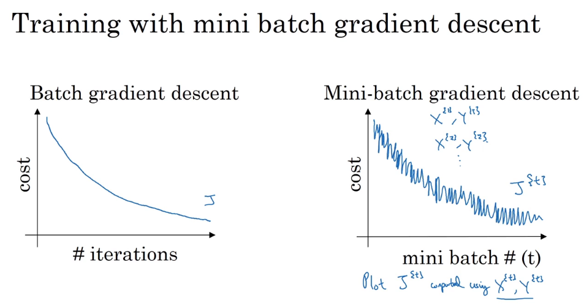
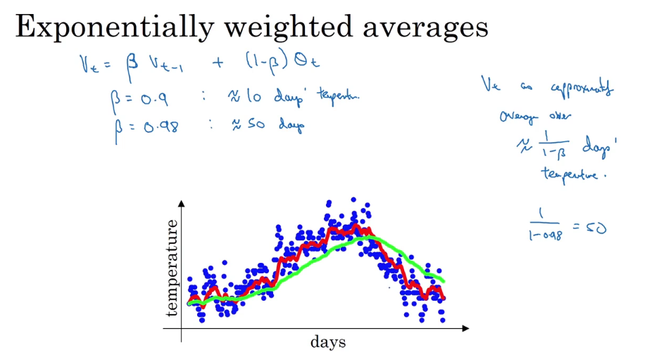
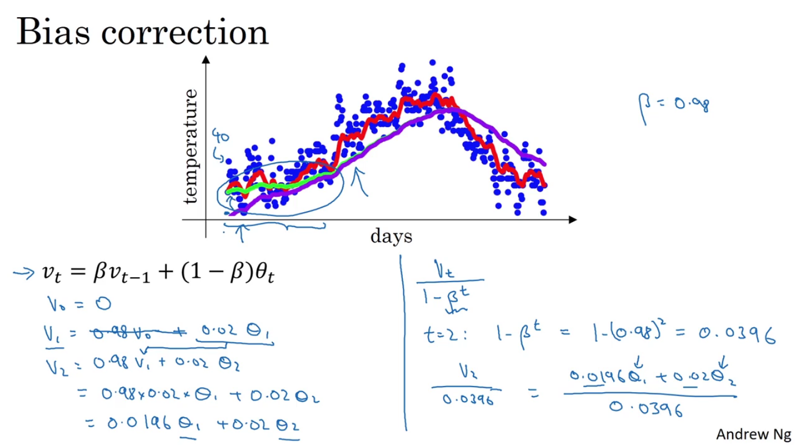
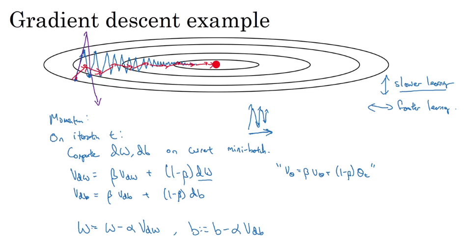
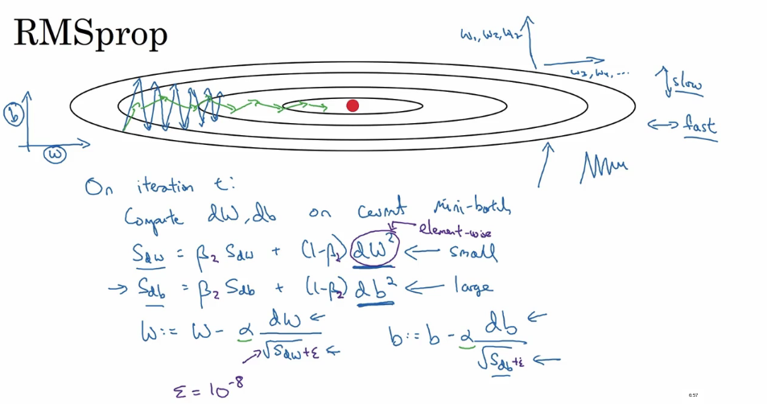
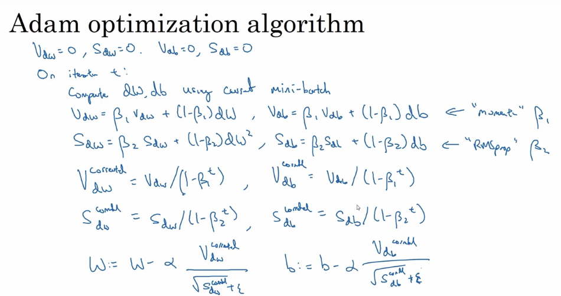
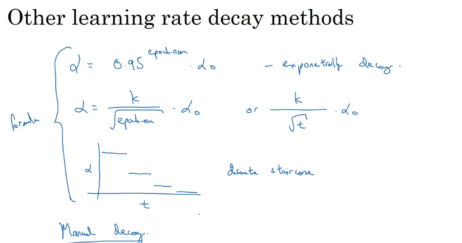
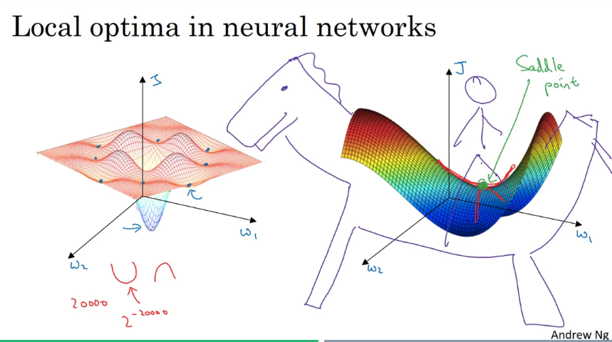

这一周讨论优化算法。

## Mini-batch gradient desent

一次梯度下降迭代使用所有数据非常耗时，于是人们想出了一个好办法，把数据划分成很多部分，每次用一部分数据来训练，节约时间，跑的比原来快多了。在训练大量数据时，这一方法很有效。

代价函数随迭代次数的变化：

我们需要选择mini-batch的大小，如果等于训练集的大小，那么就是batch gradient desent，如果等于1，那么就是stochastic gradient desent，前者每一次迭代太慢，后者不能利用向量化加速，所以选择适中的值最好。如果训练集较小，比如小于2000个，那么可以使用batch gradient desent。一般mini-batch大小选择2的幂，通常是64,128,256或512。需要确保mini-batch能够放入CPU/GPU的内存，否则性能会大幅下降。

## Exponentially weighted averages

展开几次可感受这个公式到底算了什么。

## Bias correction in exponentially weighted averages

Bias correction要解决的问题是起步时计算偏差较大。因为$v_0=0$，所以前面的$v$会偏小，这里的做法是把$v_t$修正为$$v_t \over 1 - \beta ^ t$$。

## Gradient desent with momentum

普通的梯度下降，学习率大可能导致震荡甚至发散，学习率小会导致学习很慢。如图，这是代价函数等高线，中间最低，我们希望横向学得快一点，纵向学得慢一点，于是我们引入动量。不再直接用d来更新参数，用$v$，$v$由$d$来逐渐地改变。红线为采用动量梯度下降后更新的折线。这里增加了一个超参数$\beta$，一般用0.9就可以。

## RMSprop

我们已经知道了动量是如何加速梯度下降的，有另一个算法叫做RMSprop(Root mean square prop)也可以加速梯度下降。最后一行分母加上$\varepsilon$是因为防止原分母等于0。

有趣的一点是，RMSprop并不是在学术论文中提出的，而是在Coursera上很久以前的一门课上提出的。

## Adam optimization algorithm

Adam(Adaptive Moment Estimation)是一种结合了momentum和RMSprop的算法，非常好用。[Adam论文](https://arxiv.org/pdf/1412.6980.pdf)。$v$用动量计算，$s$用RMSprop计算，然后进行bias correction，最后更新参数。

超参数选择上，$\alpha$是需要调整的，$\beta_1$一般0.9，$\beta_2$一般0.999，$\varepsilon$一般10e-8。

## Learning rate decay

加速学习过程的一个可行的方法是慢慢逐渐减小学习率。

可行的一种计算方法： $$\alpha = {\alpha_0 \over 1 + decayRate \times epochNum}$$

还有好多其他方法，大同小异，目的都是让学习率逐渐减小。最后，手动调整也是可以考虑的。

## The problem of local optima

Local optima并不多见，更多的是saddle point，图画得不错。

问题在于，plateau，很平的一片区域，梯度很小，学习很慢。这时前面的各种算法可以派上用场。

结论：

- Unlikely to get stuck in a bad local optima
- Plateaus can make learning slow

## Assignment

What you should remember:

- The difference between gradient descent, mini-batch gradient descent and stochastic gradient descent is the number of examples you use to perform one update step.
- You have to tune a learning rate hyperparameter αα.
- With a well-turned mini-batch size, usually it outperforms either gradient descent or stochastic gradient descent (particularly when the training set is large).
- Shuffling and Partitioning are the two steps required to build mini-batches
- Powers of two are often chosen to be the mini-batch size, e.g., 16, 32, 64, 128.
- Momentum takes past gradients into account to smooth out the steps of gradient descent. It can be applied with batch gradient descent, mini-batch gradient descent or stochastic gradient descent.
- You have to tune a momentum hyperparameter β and a learning rate α.
