这一周讨论超参数调整，批量归一化，和编程框架。

## Hyperparameter tuning

### Tuning process

在我们的网络中，有很多超参数要调，如$\alpha$, $\beta$, $\beta_1$, $\beta_2$, $\varepsilon$，网络层数，隐藏单元的数量，学习率衰减，mini-batch大小，通常来说，α是最重要的，然后是β，隐藏单元的数量，mini-batch大小，然后是网络层数，学习率衰减，最后是$\beta_1$, $\beta_2$, $\varepsilon$。

在调参的过程中，假设我们有两个参数要调，不要像左图一样设置你的参数，要像右图一样随机的尝试，这是因为，假设参数1很重要，而参数2影响很小，那么左图中实际上只试验了5个值，而右图参数1的值各不相同。

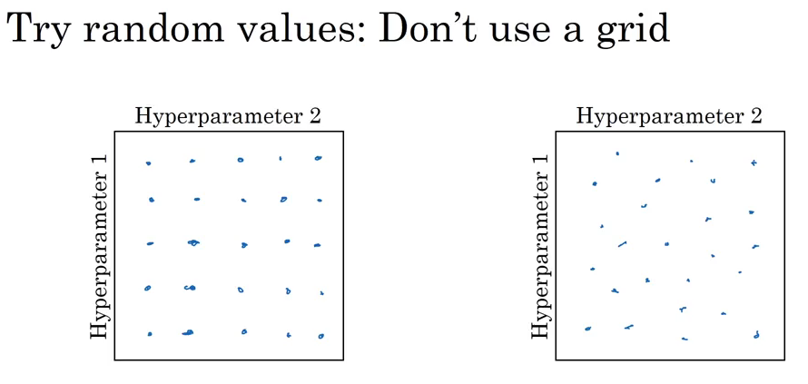

在调参的过程中，在我们试验的点中，我们找到了最佳的一个，也许周围的几个也表现不错，这时我们可以缩小试验范围，划出一片更小的区域尝试更多的点。

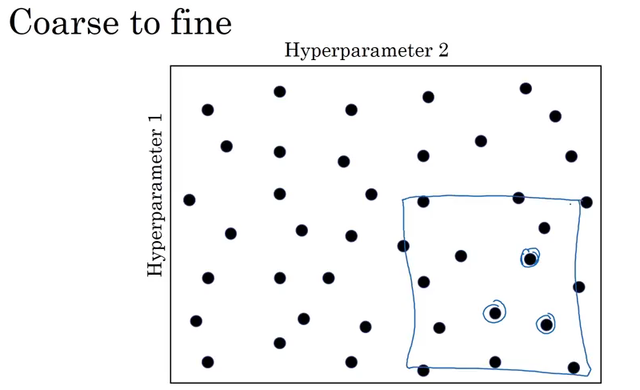

### Using an appropriate scale to pick hyperparameters

随机的选取参数并不代表在参数的范围内均匀地随机选取，根据具体情况，我们需要使用适当的缩放比例来选取超参数。如果我们要调整层数，一层的单元数，那么均匀的选择没有问题，然而不是所有的参数都适合用这种方式调整。假设我们调整α，取值范围是0.0001到1，我们希望尝试的是不同的数量级，可以使用如图的方式进行抽样，$r = -4 \times np.random.rand()$，$\alpha = 10 ^ r$。

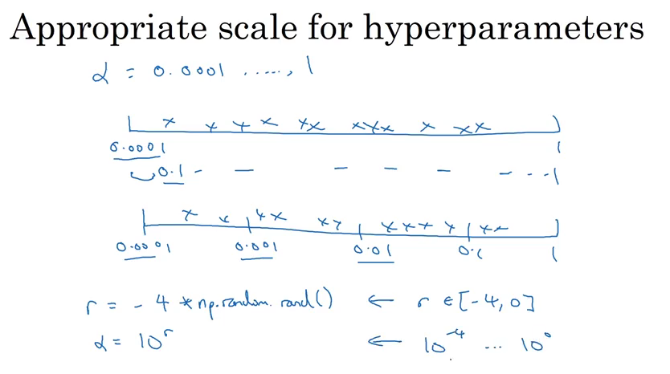

### Hyperparameters tuning in practice: Pandas vs. Caviar

如果你穷，那么就一次跑一个模型，就像熊猫照看一个宝宝，如果你不差钱，那么可以同时跑很多模型，就像鱼子一样多。这两个词应该是达叔乱取的。

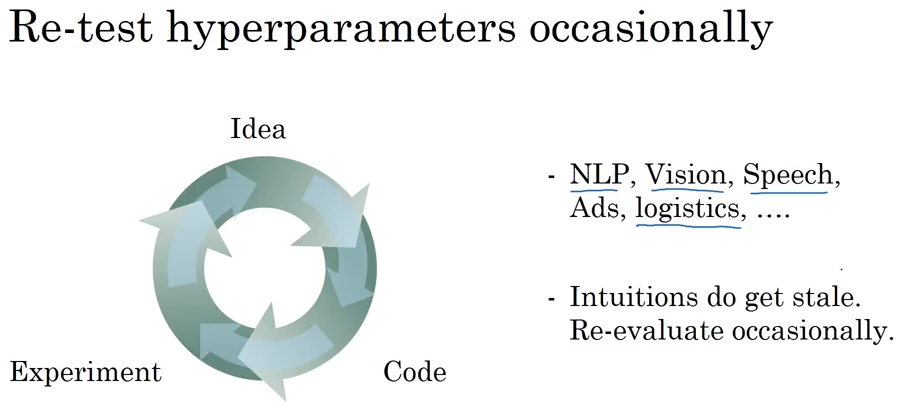

## Batch Normalization

### Normalizing activations in a network

之前我们学习过将输入归一化来加速学习过程，实际上隐藏层的输入也可以进行归一化，这就是Batch normalization。归一化可以选择在$z$上做（激活函数之前），或在$a$上做（激活函数之后），学术界对此有一定争论，达叔说实践中在激活函数之前做更多一点。

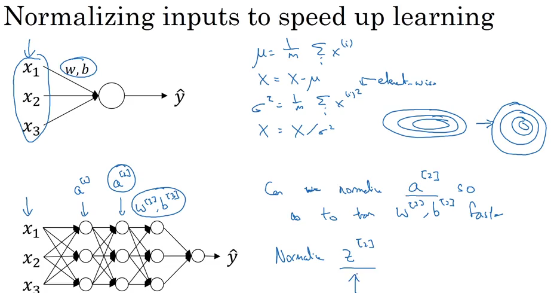

下面是具体的实现方法。注意在归一化时，最后有一个线性变换，因为有时候我们不总是希望变量的均值是0，方差是1，这里的两个参数$\gamma$和$\beta$是可以学习的参数。

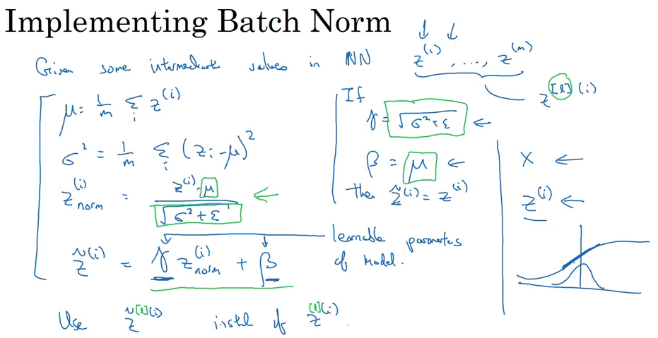

### Fitting Batch Norm into a neural network

在计算$z$的时候，不需要加上$b$，因为归一化后会把$b$去掉，$\gamma$和$\beta$的维度和$z$是一致的。

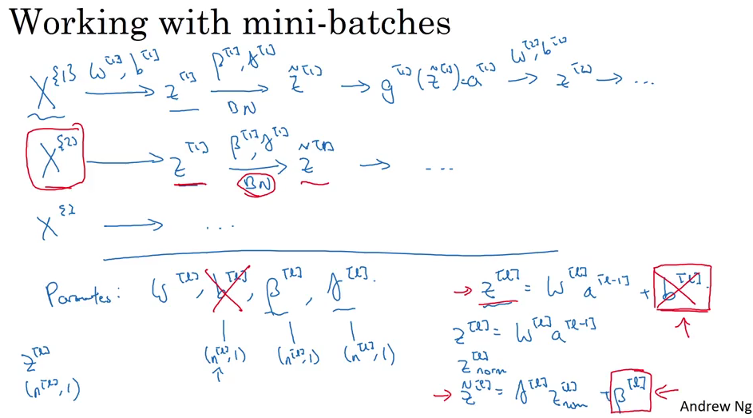

### Why does Batch Norm work?

那么Batch Norm为什么有效呢，原因之一是正如对输入进行归一化可以加速学习过程一样，Batch Norm做了相似的事情。不过，这只是Batch Norm的一方面，第二个原因是能够减小减小前面结果的变化对后面的影响，使得每一层的训练有着稳定分布的输入。

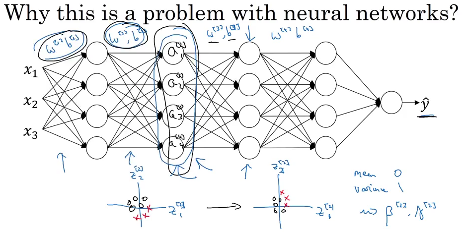

Batch Norm还起到了轻微的正则化效果，如图。mini-batch size越大，正则化效果越不明显。Batch Norm的目的不是正则化，并且效果很微弱，所以不要把Batch Norm当作一种正则化手段。

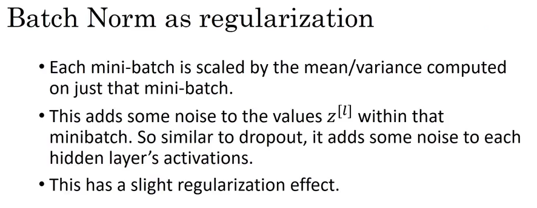

### Batch Norm at test time

在训练中，Batch Norm是对每一个mini-batch计算均值和方差，而在预测中，只有一个数据。针对这一问题，我们可以估算一个全局的均值和方差，可以使用exponential weighted average来估算，当然也可以直接对所有数据直接进行计算，或者用其他合理的方式来估算。

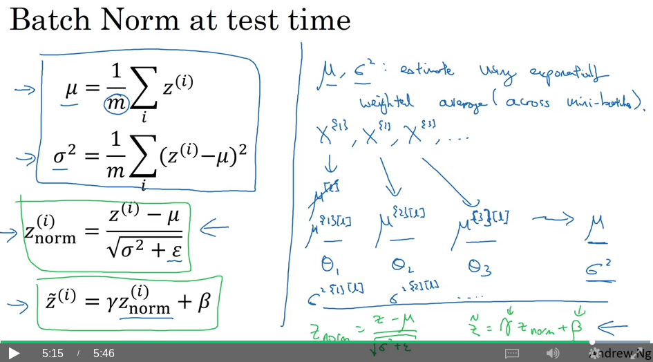

## Multi-class classification

### Softmax Regression

前面都是讲二分类问题，对于多分类问题，在最后一层可以使用softmax函数。

### Training a softmax classifier

Softmax regression中如果类别数等于2，那么就是logistic regression。

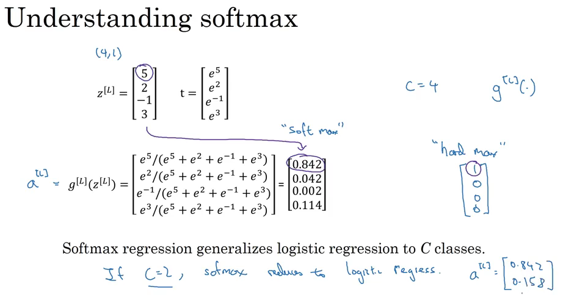

损失函数可以这么定义，cross-entropy。

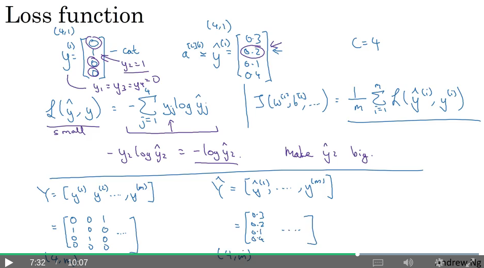

## Introduction to programming frameworks

### Deep learning frameworks

深度学习框架的选择有很多，tensorflow, pytorch, paddlepaddle等。

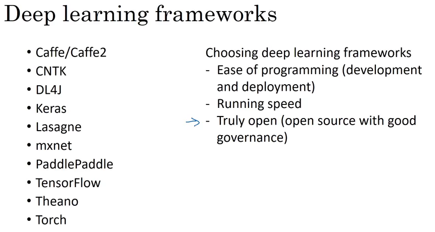

### Tensorflow

[Tensorflow](https://www.tensorflow.org/)是一个著名的深度学习框架。

## Assignment

这次的作业是基于Tensorflow做一个手势数字识别的程序。

What you should remember:

- Tensorflow is a programming framework used in deep learning
- The two main object classes in tensorflow are Tensors and Operators.
- When you code in tensorflow you have to take the following steps:
  - Create a graph containing Tensors (Variables, Placeholders ...) and Operations (tf.matmul, tf.add, ...)
  - Create a session
  - Initialize the session
  - Run the session to execute the graph
- You can execute the graph multiple times as you've seen in model()
- The backpropagation and optimization is automatically done when running the session on the "optimizer" object.
