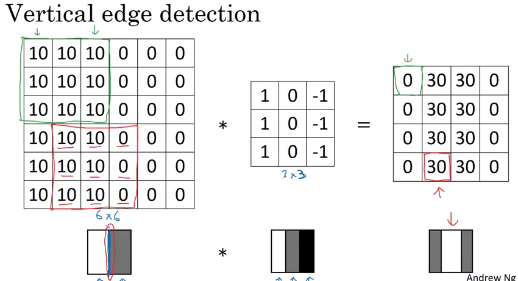
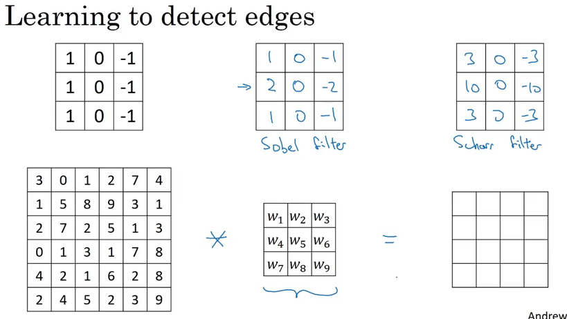
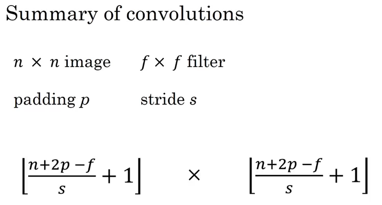
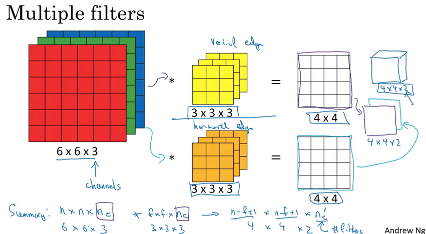
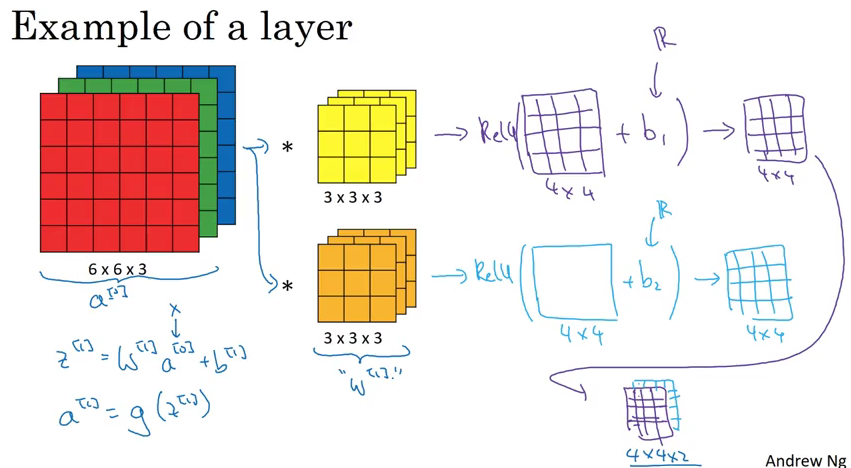
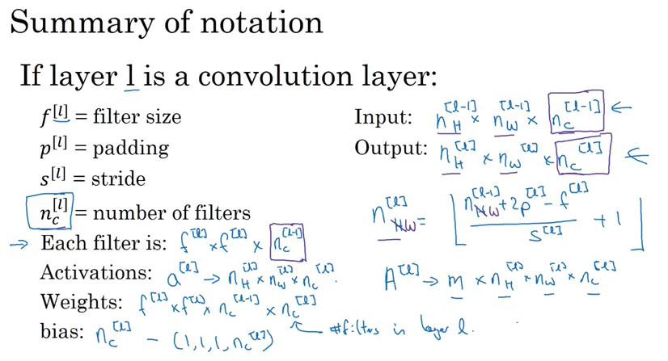
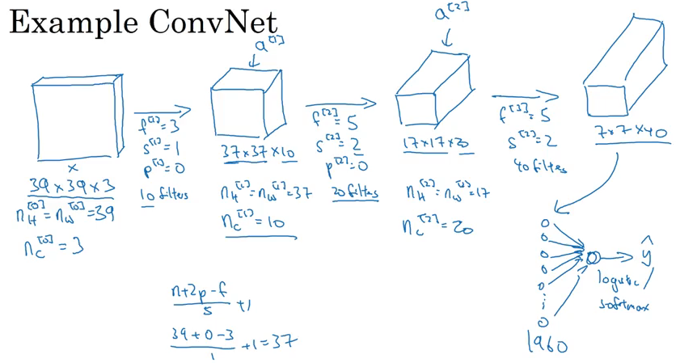
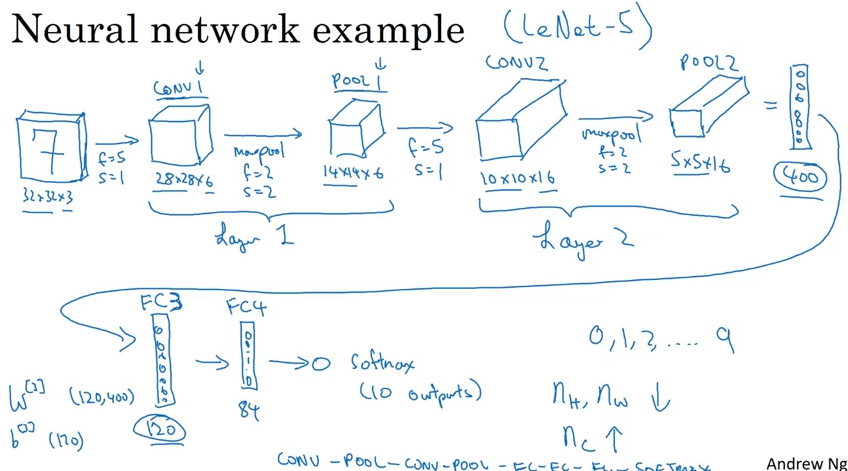
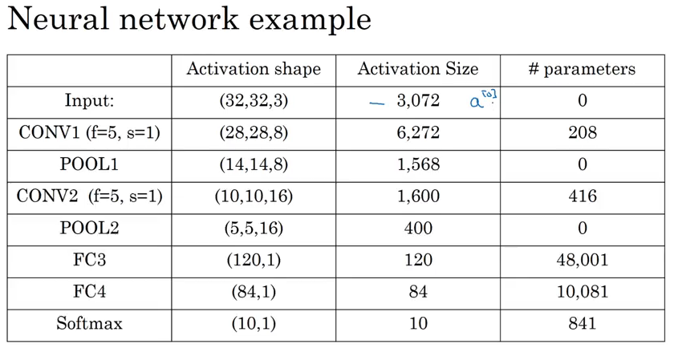
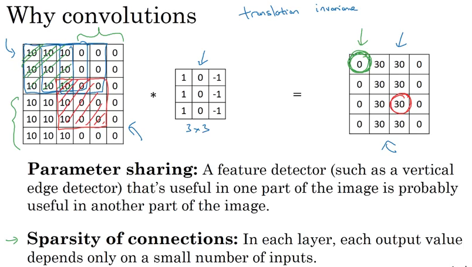

深度学习系列课程的第四门课是卷积神经网络（Convolutional Neural Networks），第一周介绍了卷积神经网络的基础，学习目标是：

- Understand the convolution operation
- Understand the pooling operation
- Remember the vocabulary used in convolutional neural network (padding, stride, filter, ...)
- Build a convolutional neural network for image multi-class classification

近年来，计算机视觉非常火爆，得益于深度学习技术的发展，计算机视觉发展迅速，在很多问题上甚至已经可以媲美人类了。计算机视觉常见的问题有图片分类、物体检测、神经风格迁移等，这门课会逐步介绍。计算机视觉问题的挑战之一是输入会很大，比如一张1000×1000的图片，就有1000×1000×3个特征，3是rgb通道数量，所以人们使用了卷积。

举个边缘检测的例子，左边的是原图片，中间的是filter或者叫kernel，两者进行卷积操作，右边的是输出的结果。

我们可以把filter中的数当作参数来学习。

假设图片的大小是6×6，filter的大小是3×3，那么卷积之后的图片大小就是4×4，这里有两个问题：（1）每做一次卷积图片就会变小，（2）对于边角的像素来说，被用到的次数较少，比如左上角的像素只会被用到一次，这样就会丢失很多边角上的信息。padding可以解决这一问题，padding就是在原图的外面加一圈，也可以加好几圈，这样卷积之后的图片就不会那么小。输出的大小（某一维）$= n + 2p - f + 1$，$n$是输入的大小， $p$是padding的大小，$f$是filter的大小。Valid convolution就是没有padding，same convolution指输出的大小和输入的大小一样，根据公式，$p = (f - 1) / 2$。$f$通常是奇数。

Stride是指在计算卷积时每次移动filter的距离，现在输出的大小（某一维）$= int((n + 2p - f) / s + 1)$，$s$是stride的大小。

通常图片都有三个通道，rgb，对应地，filter也是三个通道，计算卷积时是把对应位置相乘所有的积都加起来，我们可以有多个filter，每个filter生成输出的图片的一个通道。

卷积神经网络的一层的结构如下，filter相当于原来的W。

符号总结：

一个简单的卷积神经网络的例子。最后是一个全连接层，要把输入铺平变成一维的。在卷积神经网络中，一般有三种层，卷积层，池化层，全连接层。

Pooling layers，池化层，可以减小图片的表示，加速计算，还可以使检测出的特征更加健壮。常见的是最大池化和平均池化。计算输出大小的方法和算padding的一样，只是通常没有padding这个参数了。原来几个channel输出还是几个channel。池化层没有参数要学习，都是超参数。

下面看一个具体的例子，LeNet-5，这是1998年的一篇论文，用于手写数字识别。

为什么卷积这么好用呢？主要有两点原因，参数共享和稀疏连接。

