# Practical aspects of Deep Learning

深度学习系列课程第二门课的标题是Improving Deep Neural Networks: Hyperparameter tuning, Regularization and Optimization，第一周的标题是Practical aspects of Deep Learning，学习目标是：

- Recall that different types of initializations lead to different results
- Recognize the importance of initialization in complex neural networks.
- Recognize the difference between train/dev/test sets
- Diagnose the bias and variance issues in your model
- Learn when and how to use regularization methods such as dropout or L2 regularization.
- Understand experimental issues in deep learning such as Vanishing or Exploding gradients and learn how to deal with them
- Use gradient checking to verify the correctness of your backpropagation implementation

对于一个机器学习问题，首先，我们要合理地设置train/dev/test sets，即训练/开发/测试集。机器学习是一个不断迭代的过程，合理地设置训练/开发/测试集可以使得迭代过程更有效率。在过去的那个时代，训练集：测试集=7:3（如果没有开发集的话），或训练集：开发集：测试集=6:2:2，是一个通常的选择，然而在现在这个深度学习时代，数据量很多，比如说有1,000,000个数据，开发集和测试集分别有10,000个数据就够了，这时比例上就是98:1:1。另一个深度学习时代的趋势是，越来越多的人在不同分布的训练集和测试集上训练，一个重要的原则是确保开发集和测试集来自相同的分布。最后，如果你不需要对算法性能进行完全无偏差的估计，那么没有测试集也是可以的，也就是只有训练/开发集，很多人把这个叫做训练/测试集，不过作者认为前者更准确。所以，合理地设置训练/开发/测试集可以加速迭代的过程，还可以使人们更高效地衡量算法的bias和variance，从而决定下一步做什么来提升自己的算法。

据说所有的机器学习大佬都对bias和variance有着深刻的理解，这两个概念学起来很容易，但是不容易真正掌握。在深度学习时代，对bias-variance trade-off的讨论变少了。先看bias和variance的图示，左边是高bias，右边是高variance，中间正好。

从数值上判断，如果训练集错误率比人能达到的错误率高很多，那么存在high bias问题，如果开发集错误率比训练集错误率高很多，那么存在high variance问题。

我们已经知道了如何判断bias和variance问题，下一步我们需要采取行动来解决这些问题。首先，看看有没有high bias问题，如果有，可以尝试使用更大的网络，训练更长的时间，或者使用其他的网络结构。没有了high bias问题，那么再看看有没有high variance问题，如果有，可以尝试收集更多的数据，正则化，或者使用其他的网络结构。

正则化是解决variance问题的一个重要方法，先回顾一下logistic回归中的正则化，一般用L2正则化。

那么神经网络中的正则化呢，可以用类似的方式，不过改名了，叫Frobenius norm，加入正则项后，把梯度下降的公式展开就会发现，权重会再减去一项，相比原来，权重变得更小了，有一种说法叫weight decay。

另一种有效的正则化方法是dropout，如图，训练时有一定概率丢掉一些单元，使得网络变得更简单，

实现上，如图，假设在第3层做dropout，要注意最后a3要除以keep-prob，使得a3和原来的值的期望一样。

预测时不需要dropout，通常人们不希望预测结果是随机的。

除了上述两种正则化方法，我们还可以使用数据增强、早停技术，数据增强是指从已有的数据生成更多的数据，比如把原图片翻转、裁剪，加入训练集，早停就是训练时趁还没过拟合及时停止训练。

在训练神经网络时，对输入归一化可以加速网络的训练。μ是均值，σ^2是方差。训练集和测试集要使用相同的参数归一化。

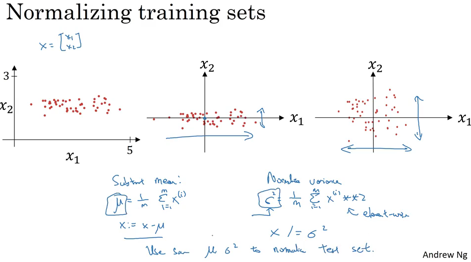

下图可以看出，归一化后，各输入在同一尺度，梯度下降进行的更快。

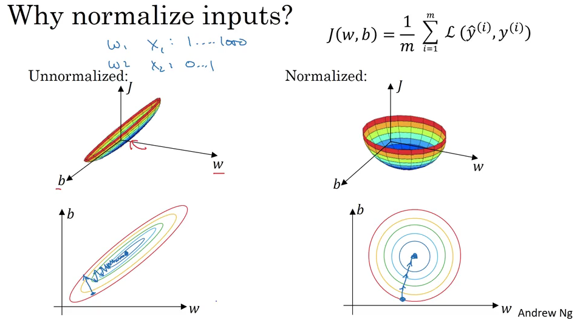

在训练神经网络，尤其是深度神经网络时，一个问题是梯度消失和梯度爆炸，也就是说在训练时，有时梯度会非常小或非常大。合适的权重初始化方式可以部分缓解这一问题，参数越多，那么每个w应该越小。

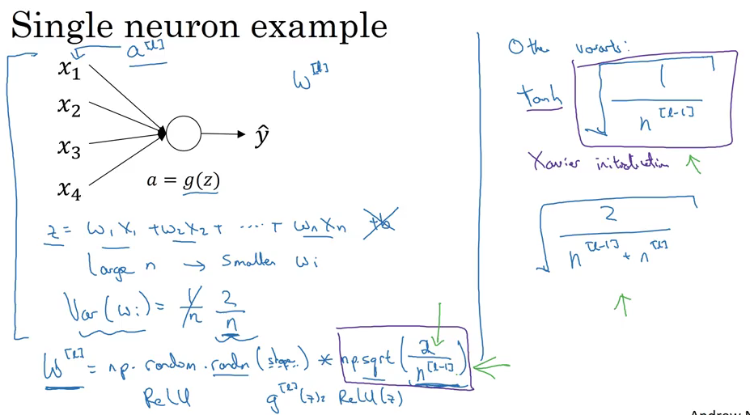

有时候，我们不知道梯度算的对不对，可以用下面的方法验证。

# Optimization algorithms

这一周讨论优化算法。

## Mini-batch gradient desent

一次梯度下降迭代使用所有数据非常耗时，于是人们想出了一个好办法，把数据划分成很多部分，每次用一部分数据来训练，节约时间，跑的比原来快多了。在训练大量数据时，这一方法很有效。

代价函数随迭代次数的变化：

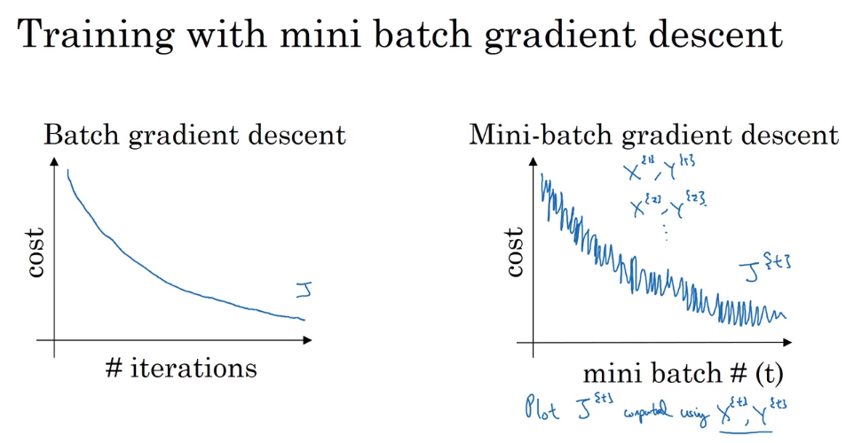

我们需要选择mini-batch的大小，如果等于训练集的大小，那么就是batch gradient desent，如果等于1，那么就是stochastic gradient desent，前者每一次迭代太慢，后者不能利用向量化加速，所以选择适中的值最好。如果训练集较小，比如小于2000个，那么可以使用batch gradient desent。一般mini-batch大小选择2的幂，通常是64,128,256或512。需要确保mini-batch能够放入CPU/GPU的内存，否则性能会大幅下降。

## Exponentially weighted averages

展开几次可感受这个公式到底算了什么。

## Bias correction in exponentially weighted averages

Bias correction要解决的问题是起步时计算偏差较大。因为$v_0=0$，所以前面的$v$会偏小，这里的做法是把$v_t$修正为$$v_t \over 1 - \beta ^ t$$。

## Gradient desent with momentum

普通的梯度下降，学习率大可能导致震荡甚至发散，学习率小会导致学习很慢。如图，这是代价函数等高线，中间最低，我们希望横向学得快一点，纵向学得慢一点，于是我们引入动量。不再直接用d来更新参数，用$v$，$v$由$d$来逐渐地改变。红线为采用动量梯度下降后更新的折线。这里增加了一个超参数$\beta$，一般用0.9就可以。

## RMSprop

我们已经知道了动量是如何加速梯度下降的，有另一个算法叫做RMSprop(Root mean square prop)也可以加速梯度下降。最后一行分母加上$\varepsilon$是因为防止原分母等于0。

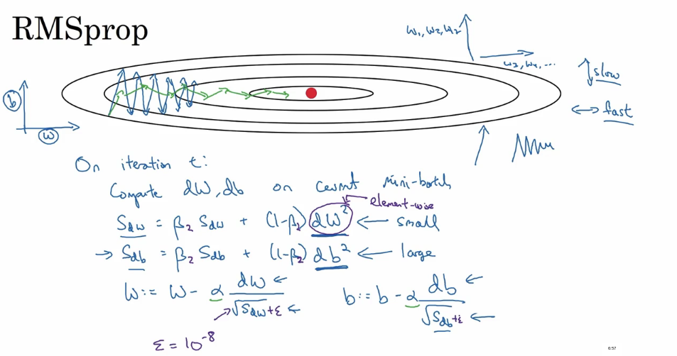

有趣的一点是，RMSprop并不是在学术论文中提出的，而是在Coursera上很久以前的一门课上提出的。

## Adam optimization algorithm

Adam(Adaptive Moment Estimation)是一种结合了momentum和RMSprop的算法，非常好用。[Adam论文](https://arxiv.org/pdf/1412.6980.pdf)。$v$用动量计算，$s$用RMSprop计算，然后进行bias correction，最后更新参数。

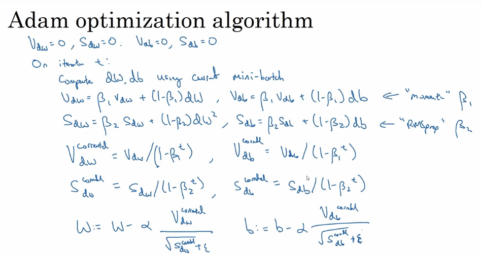

超参数选择上，$\alpha$是需要调整的，$\beta_1$一般0.9，$\beta_2$一般0.999，$\varepsilon$一般10e-8。

## Learning rate decay

加速学习过程的一个可行的方法是慢慢逐渐减小学习率。

可行的一种计算方法： $$\alpha = {\alpha_0 \over 1 + decayRate \times epochNum}$$

还有好多其他方法，大同小异，目的都是让学习率逐渐减小。最后，手动调整也是可以考虑的。

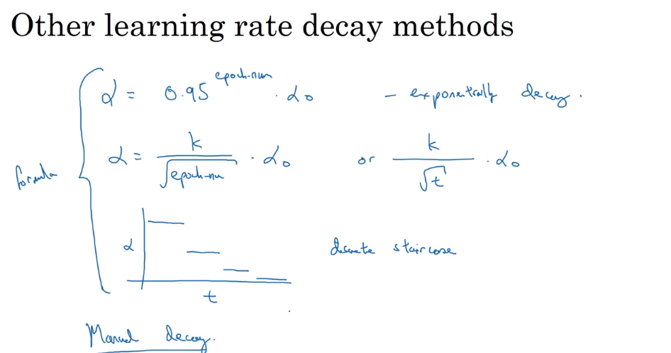

## The problem of local optima

Local optima并不多见，更多的是saddle point，图画得不错。

问题在于，plateau，很平的一片区域，梯度很小，学习很慢。这时前面的各种算法可以派上用场。

结论：

- Unlikely to get stuck in a bad local optima
- Plateaus can make learning slow

## Assignment

What you should remember:

- The difference between gradient descent, mini-batch gradient descent and stochastic gradient descent is the number of examples you use to perform one update step.
- You have to tune a learning rate hyperparameter αα.
- With a well-turned mini-batch size, usually it outperforms either gradient descent or stochastic gradient descent (particularly when the training set is large).
- Shuffling and Partitioning are the two steps required to build mini-batches
- Powers of two are often chosen to be the mini-batch size, e.g., 16, 32, 64, 128.
- Momentum takes past gradients into account to smooth out the steps of gradient descent. It can be applied with batch gradient descent, mini-batch gradient descent or stochastic gradient descent.
- You have to tune a momentum hyperparameter β and a learning rate α.

# Hyperparameter tuning, Batch Normalization and Programming Frameworks

这一周讨论超参数调整，批量归一化，和编程框架。

## Hyperparameter tuning

### Tuning process

在我们的网络中，有很多超参数要调，如$\alpha$, $\beta$, $\beta_1$, $\beta_2$, $\varepsilon$，网络层数，隐藏单元的数量，学习率衰减，mini-batch大小，通常来说，α是最重要的，然后是β，隐藏单元的数量，mini-batch大小，然后是网络层数，学习率衰减，最后是$\beta_1$, $\beta_2$, $\varepsilon$。

在调参的过程中，假设我们有两个参数要调，不要像左图一样设置你的参数，要像右图一样随机的尝试，这是因为，假设参数1很重要，而参数2影响很小，那么左图中实际上只试验了5个值，而右图参数1的值各不相同。

在调参的过程中，在我们试验的点中，我们找到了最佳的一个，也许周围的几个也表现不错，这时我们可以缩小试验范围，划出一片更小的区域尝试更多的点。

### Using an appropriate scale to pick hyperparameters

随机的选取参数并不代表在参数的范围内均匀地随机选取，根据具体情况，我们需要使用适当的缩放比例来选取超参数。如果我们要调整层数，一层的单元数，那么均匀的选择没有问题，然而不是所有的参数都适合用这种方式调整。假设我们调整α，取值范围是0.0001到1，我们希望尝试的是不同的数量级，可以使用如图的方式进行抽样，$r = -4 \times np.random.rand()$，$\alpha = 10 ^ r$。

### Hyperparameters tuning in practice: Pandas vs. Caviar

如果你穷，那么就一次跑一个模型，就像熊猫照看一个宝宝，如果你不差钱，那么可以同时跑很多模型，就像鱼子一样多。这两个词应该是达叔乱取的。

## Batch Normalization

### Normalizing activations in a network

之前我们学习过将输入归一化来加速学习过程，实际上隐藏层的输入也可以进行归一化，这就是Batch normalization。归一化可以选择在$z$上做（激活函数之前），或在$a$上做（激活函数之后），学术界对此有一定争论，达叔说实践中在激活函数之前做更多一点。

下面是具体的实现方法。注意在归一化时，最后有一个线性变换，因为有时候我们不总是希望变量的均值是0，方差是1，这里的两个参数$\gamma$和$\beta$是可以学习的参数。

### Fitting Batch Norm into a neural network

在计算$z$的时候，不需要加上$b$，因为归一化后会把$b$去掉，$\gamma$和$\beta$的维度和$z$是一致的。

### Why does Batch Norm work?

那么Batch Norm为什么有效呢，原因之一是正如对输入进行归一化可以加速学习过程一样，Batch Norm做了相似的事情。不过，这只是Batch Norm的一方面，第二个原因是能够减小减小前面结果的变化对后面的影响，使得每一层的训练有着稳定分布的输入。

Batch Norm还起到了轻微的正则化效果，如图。mini-batch size越大，正则化效果越不明显。Batch Norm的目的不是正则化，并且效果很微弱，所以不要把Batch Norm当作一种正则化手段。

### Batch Norm at test time

在训练中，Batch Norm是对每一个mini-batch计算均值和方差，而在预测中，只有一个数据。针对这一问题，我们可以估算一个全局的均值和方差，可以使用exponential weighted average来估算，当然也可以直接对所有数据直接进行计算，或者用其他合理的方式来估算。

## Multi-class classification

### Softmax Regression

前面都是讲二分类问题，对于多分类问题，在最后一层可以使用softmax函数。

### Training a softmax classifier

Softmax regression中如果类别数等于2，那么就是logistic regression。

损失函数可以这么定义，cross-entropy。

## Introduction to programming frameworks

### Deep learning frameworks

深度学习框架的选择有很多，tensorflow, pytorch, paddlepaddle等。

### Tensorflow

[Tensorflow](https://www.tensorflow.org/)是一个著名的深度学习框架。

## Assignment

这次的作业是基于Tensorflow做一个手势数字识别的程序。

What you should remember:

- Tensorflow is a programming framework used in deep learning
- The two main object classes in tensorflow are Tensors and Operators.
- When you code in tensorflow you have to take the following steps:
  - Create a graph containing Tensors (Variables, Placeholders ...) and Operations (tf.matmul, tf.add, ...)
  - Create a session
  - Initialize the session
  - Run the session to execute the graph
- You can execute the graph multiple times as you've seen in model()
- The backpropagation and optimization is automatically done when running the session on the "optimizer" object.

# ML Strategy(1)

深度学习系列课程的第三门课是Structuring Maching Learning Projects，第一周主要讲ML Strategy，即机器学习的策略，这次主要靠写，不靠贴图，我们的学习目标是

- Understand why Machine Learning strategy is important
- Apply satisficing and optimizing metrics to set up your goal for ML projects
- Choose a correct train/dev/test split of your dataset
- Understand how to define human-level performance
- Use human-level perform to define your key priorities in ML projects
- Take the correct ML Strategic decision based on observations of performances and dataset

假设我们做了一个图片分类器，精确度是90%，我们想要进一步提升精确度，这时，可选的尝试方向有很多，比如收集更多的数据，收集更广泛的训练集，训练更长时间，使用Adam算法，使用更大的网络，使用更小的网络，使用dropout，增加正则化，调整网络结构等，如果不幸选择了错误的方向，那么很有可能花了很多时间，最后得到的结论就是这种方法没有效果。所以，能够快速的判断哪些方法可能是有帮助的，哪些方法是无效的，是很有意义的，可以节省大量时间，加速模型迭代。

一个模型有很多参数要调节，最好的方式是明确调节一个参数所对应的效果，不同的参数有各自相对独立的效果，这叫做正交（Orthogonalization）。举个例子，老式电视机上一般有几个物理旋钮，通常一个可以调节亮度，一个可以调节对比度，一个可以调节上下位置，一个可以调节左右位置，这种设计就很好，很容易调节。在神经网络中，我们通常依次需要完成以下目标，在训练集上表现良好，在开发集上表现良好，在测试集上表现良好，在真实场景中表现良好。如果在训练集上表现较差，那么可以使用更大的网络或者使用其他优化算法，接着，如果在开发集上表现较差，那么可以尝试使用正则化或使用更大的训练集，继续，如果在测试集上表现较差，那么你可能需要一个更大的开发集，最后，如果在真实场景中表现较差，那么可能需要改变开发集或者改变代价函数。一个反例是早停(early stopping)技术，这一手段会同时影响训练集和开发集，这就不是很正交了，当然，这并不是说这种技术不好或无效。

机器学习中很重要的一步是设置目标，或者说设置指标（metric），只有设置了好的指标，才能正确地评价模型，训练出好的模型。首先，最好设计一个（而不是一堆）数值指标，假设我们可以算出precision和recall，我们需要一种评价标准来比较不同的模型，所以应该设计出一个总体的指标，precision和recall为例的话，标准的做法是F1 Score，等于2/(1/p+1/r)。

然而，有时候设计出一个单独的指标来评价模型有一定难度，在这种情况下，我们可以设计满足指标（Satisficing metric）和优化指标（Optimization metric），简单地说，satisficing metric就是模型必须要满足的条件。

如何设置train set, dev set, test set非常重要，对机器学习项目的进展有很大影响，如果没有设置好，那么可能会使项目进展很慢。非常重要的一点就是，要使dev set和test set来自相同的分布。

我们需要合理地划分train, dev, test集合的大小，在传统的机器学习中，可能是70%训练集，30%测试集，或者60%训练集，20%开发集，20%测试集，然而在深度学习中，由于数据量通常很大，所以我们不需要那么高比例的开发集和测试集，假设有1000000个数据，那么1%的开发集和1%的测试集就足够了。对于测试集的大小，应该要足够大，提供高可信度。有时没有测试集也是可以的，不过不是很推荐哦。

我们希望机器学习模型能够达到人类水平，甚至超过，bayes error指错误率的下限，human-level error可以认为是bayes error的一个近似，training error和人类水平的差距可以叫做avoidable bias, dev error和training error的差距则是variance，根据哪个更大可以决定先处理bias还是variance问题。

最后，总结一下，如何提高模型的性能，设置好评价指标，合理划分train，dev，test集，合理诊断bias还是vaviance。

# ML Strategy(2)

这一周还是讲ML Strategy，主要内容是错误分析，不匹配的训练集和开发/测试集，从多任务中学习，端到端的深度学习，学习目标是：

- Understand what multi-task learning and transfer learning are
- Recognize bias, variance and data-mismatch by looking at the performances of your algorithm on train/dev/test sets

## 错误分析

为了使模型变得更好，我们需要分析错误分类的例子，造成错误的原因有很多，可以数一下每种错误占的比例，来决定先解决哪一种问题，因为如果某一种错误占的比例很小，那么并不值得优先去花大力气。

假设在训练集上有一些错误标注的数据，深度学习算法对训练集上的随机错误是健壮的（robust），但对系统错误就不是那么健壮了。在进行错误分析时，如果由错误标注导致的错误占比较多，那么应该考虑改正这些错误标注，开发集和测试集都要改，另外，正确的预测中也可能会包含错误的标注，也可以一看，不过数据量较大，因为通常模型的正确率会比较高。训练集由于数据量太大，很难人工去修改，现在训练集和开发/测试集的分布不一致了，实际上，轻微的不一致是可以接受的。

做机器学习的要诀之一就是快速做出第一个系统，快速迭代。

## 不匹配的训练集和开发/测试集

深度学习需要大量数据，但是没有那么多和开发/测试集分布一致的数据作为训练集，这些数据也是可以使用的，那么如何在这种情况下进行训练呢？我们可以把开发/测试集划出一部分数据，合入训练集，再从训练集中划出一小块作为训练开发集（training-dev set）。

在新的集合设置上，重新明确一下bias和variance，human level error (avoidable bias) training set error (variance) training-dev set error (data mismatch) Dev set error。

解决数据不匹配的问题，首先要人工进行错误分析，理解训练集和开发集的数据的区别是什么，然后努力使训练集变的和开发集相似，或者说收集更多的相似的数据作为训练集。为了获得更多的数据，可以人工合成数据，要注意不要合成出来的数据只是所有可能数据的很小的一个子集。

## 从多任务中学习

迁移学习了解一下，对于相似的任务不需要从头学习，可以利用已经训练的网络模型。什么时候可以用迁移学习：

- Task A and B have the same input x.
- You have a lot more data for Task A than Task B.
- Low level features from A could be helpful for learning B.

再了解一下多任务学习，就是多个任务同时学习，比如自动驾驶中，判断一张图片中有没有行人，有没有车，有没有交通标志。什么时候可以用多任务学习：

- Training on a set of tasks that could benefit from having shared lower-level features.
- Usually: Amount of data you have for each task is quite similar.
- Can train a big enough neural network to do well on all the tasks.

比起多任务学习，迁移学习更常用一点。

## 端到端的深度学习

端到端的深度学习在有足够的数据的情况下，可以表现得很好，可以简化系统设计，但是端到端的深度学习也不是万能的。它的优点有：

- Let the data speak
- Less hand-designing of components needed

缺点包括：

- May need large amount of data
- Excludes potentially useful hand-designed components

是否使用端到端的深度学习的关键问题是：Do you have sufficient data to learn a function of the complexity needed to map x to y?

# Foundations of Convolutional Neural Networks

深度学习系列课程的第四门课是卷积神经网络（Convolutional Neural Networks），第一周介绍了卷积神经网络的基础，学习目标是：

- Understand the convolution operation
- Understand the pooling operation
- Remember the vocabulary used in convolutional neural network (padding, stride, filter, ...)
- Build a convolutional neural network for image multi-class classification

近年来，计算机视觉非常火爆，得益于深度学习技术的发展，计算机视觉发展迅速，在很多问题上甚至已经可以媲美人类了。计算机视觉常见的问题有图片分类、物体检测、神经风格迁移等，这门课会逐步介绍。计算机视觉问题的挑战之一是输入会很大，比如一张1000×1000的图片，就有1000×1000×3个特征，3是rgb通道数量，所以人们使用了卷积。

举个边缘检测的例子，左边的是原图片，中间的是filter或者叫kernel，两者进行卷积操作，右边的是输出的结果。

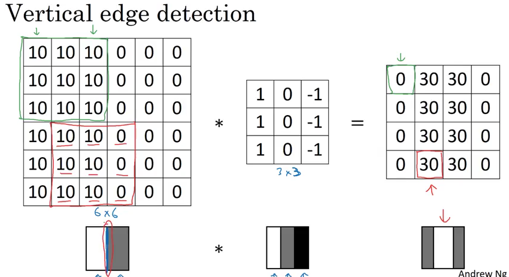

我们可以把filter中的数当作参数来学习。

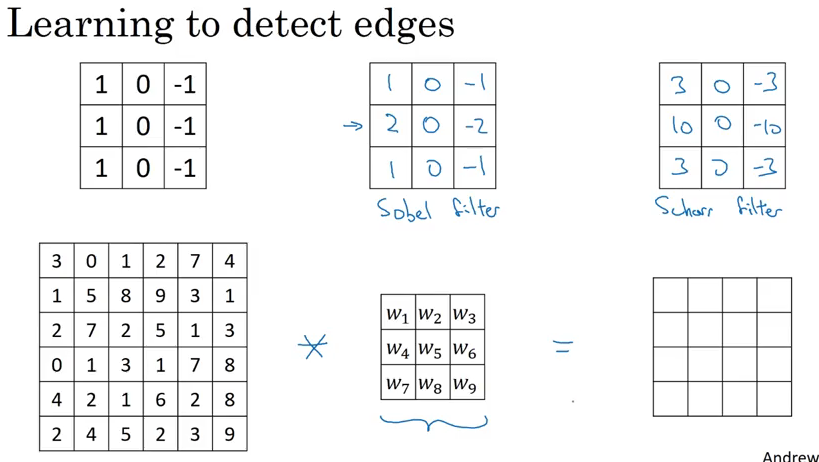

假设图片的大小是6×6，filter的大小是3×3，那么卷积之后的图片大小就是4×4，这里有两个问题：（1）每做一次卷积图片就会变小，（2）对于边角的像素来说，被用到的次数较少，比如左上角的像素只会被用到一次，这样就会丢失很多边角上的信息。padding可以解决这一问题，padding就是在原图的外面加一圈，也可以加好几圈，这样卷积之后的图片就不会那么小。输出的大小（某一维）$= n + 2p - f + 1$，$n$是输入的大小， $p$是padding的大小，$f$是filter的大小。Valid convolution就是没有padding，same convolution指输出的大小和输入的大小一样，根据公式，$p = (f - 1) / 2$。$f$通常是奇数。

Stride是指在计算卷积时每次移动filter的距离，现在输出的大小（某一维）$= int((n + 2p - f) / s + 1)$，$s$是stride的大小。

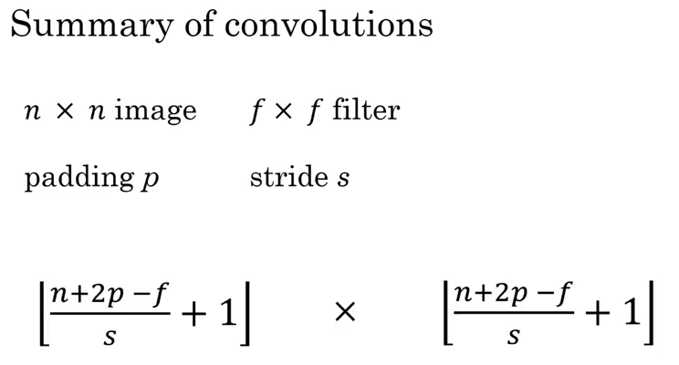

通常图片都有三个通道，rgb，对应地，filter也是三个通道，计算卷积时是把对应位置相乘所有的积都加起来，我们可以有多个filter，每个filter生成输出的图片的一个通道。

卷积神经网络的一层的结构如下，filter相当于原来的W。

符号总结：

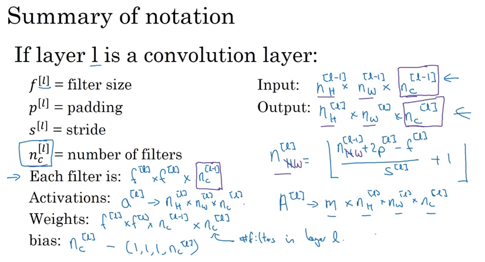

一个简单的卷积神经网络的例子。最后是一个全连接层，要把输入铺平变成一维的。在卷积神经网络中，一般有三种层，卷积层，池化层，全连接层。

Pooling layers，池化层，可以减小图片的表示，加速计算，还可以使检测出的特征更加健壮。常见的是最大池化和平均池化。计算输出大小的方法和算padding的一样，只是通常没有padding这个参数了。原来几个channel输出还是几个channel。池化层没有参数要学习，都是超参数。

下面看一个具体的例子，LeNet-5，这是1998年的一篇论文，用于手写数字识别。

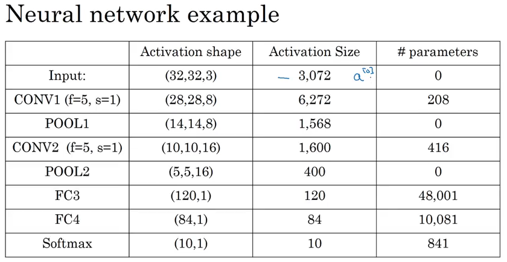

为什么卷积这么好用呢？主要有两点原因，参数共享和稀疏连接。

